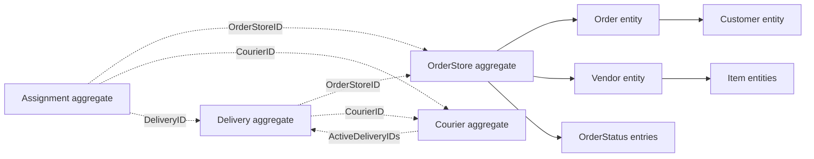

# Courier Flow

Courier Flow is a Go application for assigning each store's delivery to a courier.
It uses hexagonal architecture and four DDD bounded contexts: **Order**, **Courier**,
**Delivery**, and **Dispatch**. Assignment can be automatic or manual.

The current runtime uses hardcoded fixtures and in-memory repositories. There is
no database connection. Data and generated IDs reset when the process restarts.
This guide describes the behavior implemented in the source today.

## Contents

- [Run and configure](#run-and-configure)
- [Architecture and ownership](#architecture-and-ownership)
- [Shared identity and location](#shared-identity-and-location)
- [Order domain](#order-domain)
- [Courier domain](#courier-domain)
- [Delivery domain](#delivery-domain)
- [Dispatch domain](#dispatch-domain)
- [Application services](#application-services)
- [Transactions and in-memory data](#transactions-and-in-memory-data)
- [HTTP API](#http-api)
- [Verification and current limits](#verification-and-current-limits)

## Run and configure

Use Go **1.26.2**, as declared in [go.mod](go.mod), and run commands from the
project root:

```sh
go run ./cmd/api
```

The server defaults to `0.0.0.0:8080`. An optional `.env` file can override it:

```dotenv
COURIER_APP_ENVIRONMENT=development
COURIER_HTTP_HOST=0.0.0.0
COURIER_HTTP_PORT=8000
```

| Setting | Default | Effect |
| --- | --- | --- |
| `COURIER_APP_ENVIRONMENT` | `development` | `production` selects Gin release mode. |
| `COURIER_HTTP_HOST` | `0.0.0.0` | Address on which the HTTP server listens. |
| `COURIER_HTTP_PORT` | `8080` | Port on which the HTTP server listens. |

Configuration precedence is **process environment → `.env` → defaults**.
The loader reads `.env` from the working directory. Restart the process after
changing its configuration. With the example above, the health URL is
`http://localhost:8000/health`.

Source: [config.go](internal/infrastructure/config/config.go).

## Architecture and ownership

| Bounded context | Business responsibility | Aggregate root |
| --- | --- | --- |
| Order | The details and readiness of one store's portion of an order. | `OrderStore` |
| Courier | Courier availability, position, capabilities, and reserved capacity. | `Courier` |
| Delivery | The execution and tracking of one store delivery by one courier. | `Delivery` |
| Dispatch | Eligibility, selection, and the recorded assignment decision. | `Assignment` |

An **aggregate root** is the entry point for changing its owned state. It enforces
rules before applying changes. An **entity** has an identity within that model.
A **value object** is defined by its contents, such as a geographic location.

```text
HTTP request
    │
    ▼
Handler                  Parses bodies/path parameters and writes HTTP responses
    │
    ▼
Application service      Coordinates aggregates through ports and a UOW
    │
    ├── Domain models    Enforce business rules and state transitions
    └── Outbound ports   Repository, routing, clock, and transaction contracts
             ▲
             │ implemented by
Infrastructure           In-memory repositories, routing adapter, clock, UOW
```

The dependency container wires the implementations. Route files only connect
paths and HTTP methods to handlers.

```text
cmd/api/                              Application entry point
internal/app/order/domain/            Store aggregate and owned entities
internal/app/order/ports/             Order-store repository contract
internal/app/courier/domain/          Courier aggregate and rules
internal/app/courier/ports/           Courier repository contract
internal/app/delivery/{domain,ports,service,handler}/
internal/app/dispatch/{domain,ports,service,handler}/
internal/infrastructure/memory/       Fixtures, repositories, UOW, routing, clock
internal/infrastructure/httpserver/   Gin setup, routes, health handler
internal/infrastructure/container/    Dependency wiring
internal/infrastructure/config/       Environment and .env loading
internal/shared/{ddd,geo,uow}/        Shared primitives and UOW contract
```

Domain packages do not import other bounded contexts or infrastructure libraries.
Application services translate between contexts. For example, dispatch constructs
a `Candidate` from a courier and constructs delivery stops from order details.
Repositories operate on aggregate roots; customer, item, and vendor entities are
saved as part of their owning `OrderStore`.

### Aggregate relationships



Solid arrows mean ownership inside an aggregate. Dotted arrows mean references
by ID between aggregates. A delivery holds address/location snapshots and IDs;
it does not embed the mutable courier or order-store aggregate.

## Shared identity and location

### Identity, properties, and copies

| API or concept | Meaning |
| --- | --- |
| `ddd.ID` | String identity. `ddd.NewID()` generates a ULID. |
| `ID()` | Returns an aggregate's or entity's internal ID. |
| `Props()` | Returns its current properties. Domain wrappers protect owned collections with defensive copies. |
| `Version()` | Available on `OrderStore`, `Courier`, and `Delivery`; increments on successful aggregate updates. |
| `Clone()` | Copies an aggregate for repository/transaction isolation. Domain methods preserve isolation when changing collections. |

The shared generic aggregate/entity types have update mechanisms, but domain
wrappers keep those fields private. Call business methods such as `AddItems()`
or `ReserveDelivery()` instead of changing properties directly.

Versions are currently change counters. The memory adapter's UOW provides
concurrency protection; repository saves do not implement version comparisons.

Internal IDs differ from the external identifiers in order properties:

| Identifier | Example | Purpose |
| --- | --- | --- |
| `OrderStore.ID()` | Generated ULID string | Used by dispatch and delivery references. |
| `OrderStoreProps.OrderStoreId` | `1001` | External ID of a store's portion of an order. |
| `OrderProps.OrderId` | `demo-order-1` | External order identity shared by sibling stores. |
| `VendorProps.VendorId` | `101` | External vendor identity; used by `AddItems`. |

### Location value object

Source: [location.go](internal/shared/geo/location.go).
Order and Courier expose aliases to the shared `geo.Location` type.

| Field in `LocationProps` | Type | Rule |
| --- | --- | --- |
| `Latitude` | `float64` | Finite value in `[-90, 90]`. |
| `Longitude` | `float64` | Finite value in `[-180, 180]`. |

`NewLocation()` validates coordinates and creates an immutable location.
`Validate()` also distinguishes a missing location from a constructed one:
`Location{}` is missing, while a constructed `(0, 0)` location is valid.

`Value()` returns coordinates, `Equal()` compares values, and `DistanceKM()`
calculates Haversine straight-line distance in kilometers. Callers must supply
valid locations when calculating distances.

## Order domain

The Order context owns **what must be delivered for one store**, including its
vendor, items, recipient, requirements, and lifecycle.

### OrderStore aggregate

Sources: [order-store.model.go](internal/app/order/domain/order-store.model.go),
[order-store.props.go](internal/app/order/domain/order-store.props.go).

One `OrderStore` contains one vendor. A customer order involving multiple vendors
is represented by separate store aggregates sharing the same `OrderId`:

```text
OrderId = "order-123"
    ├── OrderStore A → Bakery → Delivery A → Courier X
    └── OrderStore B → Market → Delivery B → Courier Y
```

Each store has independent status and assignment. The current `Order` entity is a
snapshot owned by each store, so there is no parent aggregate containing all stores
and no automatic synchronization of customer/total changes across sibling stores.

| Field in `OrderStoreProps` | Type | Meaning and rules |
| --- | --- | --- |
| `OrderStoreId` | `uint` | Required external store-order ID; must be nonzero. The memory repository rejects duplicates across aggregate IDs. |
| `City` | `string` | Required nonblank city. The vendor must have exactly the same city. |
| `VehicleNeeded` | `VehicleType` | `""`, `bike`, or `car`. Dispatch requires a car only for `car`; the other values allow either vehicle. |
| `IsCash` | `bool` | Payment metadata; does not itself affect eligibility. |
| `RequiresPOS` | `bool` | Requires a courier with a POS device during dispatch. |
| `PreparationTime` | `time.Time` | Required expected preparation timestamp. It does not automatically mark the store ready or schedule dispatch. |
| `Order` | `Order` | Owned order entity; can be absent while constructing the draft. |
| `Vendor` | `Vendor` | Owned vendor entity; can be absent while constructing the draft. |
| `Status` | `Status` | Current store lifecycle status. |
| `History` | `[]OrderStatus` | Chronological history of successful edits and transitions. |

`NewOrderStore(CreateOrderStoreProps)` takes only the first six fields. It generates
an internal ID, sets `create_order`, and records the initial history entry. It does
not require the entire object graph at creation. `ValidateOrderStore()` checks the
basic draft fields; `MarkReady()` checks that the draft is complete.

| Behavior | Preconditions and effect |
| --- | --- |
| `AddOrder(OrderProps)` | Draft only. Creates and attaches one order; rejects a second order. |
| `AddCustomer(CustomerProps)` | Draft only, after `AddOrder`. Creates and attaches the customer; replaces an existing customer if called again. |
| `AddVendor(VendorProps)` | Draft only. Requires a matching city and no existing vendor. Creates and attaches the vendor. |
| `AddItems(vendorID, []ItemProps)` | Draft only. Requires a nonempty item list and the attached vendor's external `VendorId`. Validates all items before committing the edit. Appends items without merging duplicate titles. |
| `MarkReady(at)` | Draft only. Requires a valid order, customer, vendor, and at least one item; changes status to `order_is_ready`. |
| `Assign(at)` | Requires `order_is_ready`; changes status to `assigned`. |
| `PickUp(at)` | Requires `assigned`; changes status to `picked_up`. |
| `Complete(at)` | Requires `picked_up`; changes status to `delivered`. |
| `Cancel(at)` | Allowed from draft, ready, or assigned; changes status to `cancelled`. |

“Draft” means `create_order` or `update_order`. Every successful `Add*` call changes
status to `update_order` and appends history. Failed edits leave the aggregate
unchanged. Once ready, its contents cannot be edited through these methods.

`Assign()` changes the store lifecycle only. Use a dispatch application service to
also create a delivery and reserve courier capacity. Once a delivery exists, use
`DeliveryService.Transition()` for pickup, completion, or cancellation so the
related aggregates change together.

### Order entity

Sources: [order.model.go](internal/app/order/domain/order.model.go),
[order.props.go](internal/app/order/domain/order.props.go).

| Field | Type | Meaning and rules |
| --- | --- | --- |
| `OrderId` | `string` | Required nonblank external order ID. Connects sibling store aggregates. |
| `Total` | `uint` | Supplied order amount. Zero is allowed; no currency or unit is modeled. |
| `Customer` | `Customer` | Recipient details. Optional in a draft order, required before the store becomes ready. |

`NewOrder()` generates an entity ID and calls `ValidateOrder()`. If a customer is
provided, it is validated. The amount is not calculated from items, and the code
does not split or reconcile totals across stores. `Validate()` additionally rejects
an uninitialized entity. Changes are made through the owning `OrderStore`.

### Customer entity

Sources: [customer.model.go](internal/app/order/domain/customer.model.go),
[customer.props.go](internal/app/order/domain/customer.props.go).

| Field | Type | Meaning and rules |
| --- | --- | --- |
| `Name` | `string` | Recipient name; must be nonblank. |
| `Mobile` | `string` | Contact number; trimmed length must be at least 10. No country-specific or digit-only validation is implemented. |
| `AddressText` | `string` | Required nonblank delivery address. |
| `Location` | `Location` | Valid destination coordinates. |

`NewCustomer()` and `ValidateCustomer()` enforce these fields. `Validate()` also
requires an initialized entity ID. This is a recipient snapshot for the store,
not an independently persisted customer account. Dispatch copies its address and
location into the delivery's `DropOff`.

### Vendor entity

Sources: [vendor.model.go](internal/app/order/domain/vendor.model.go),
[vendor.props.go](internal/app/order/domain/vendor.props.go).

| Field | Type | Meaning and rules |
| --- | --- | --- |
| `VendorId` | `uint` | Required nonzero external vendor ID. |
| `Title` | `string` | Required nonblank store name. |
| `AddressText` | `string` | Required nonblank pickup address. |
| `City` | `string` | Required nonblank city; checked against the store when attached. |
| `Location` | `Location` | Valid pickup coordinates. |
| `Items` | `[]Item` | Items supplied by this vendor for this store order. |

`NewVendor()` validates details and any supplied items and copies the item slice.
An empty item list is valid during draft construction. `MarkReady()` requires at
least one item. Dispatch copies this vendor's address and location into `Pickup`.

### Item entity

Sources: [item.model.go](internal/app/order/domain/item.model.go),
[item.props.go](internal/app/order/domain/item.props.go).

| Field | Type | Meaning and rules |
| --- | --- | --- |
| `Title` | `string` | Required nonblank item description. |
| `Count` | `int` | Quantity; must be greater than zero. |
| `Unit` | `string` | Required nonblank unit, such as `piece`. |

`NewItem()` generates an entity ID and calls `ValidateItem()`. Items have no product
catalog ID, price, weight, or volume in the current model. Add them through
`OrderStore.AddItems()` to preserve aggregate validation and history.

### OrderStatus entity and lifecycle

Source: [order-status.model.go](internal/app/order/domain/order-status.model.go).

| Field | Type | Meaning and rules |
| --- | --- | --- |
| `Status` | `Status` | One of the statuses below. |
| `OccurredAt` | `time.Time` | Required timestamp of the edit or transition. |

`NewOrderStatus()` creates an immutable history entry with its own entity ID.
`ValidateOrderStatus()` checks the status enum and timestamp. Transition legality
and chronological ordering are enforced by `OrderStore`, not by an isolated entry.

| Current status | Allowed next status | Trigger |
| --- | --- | --- |
| `create_order` | `update_order`, `cancelled` | Draft edit or cancellation. |
| `update_order` | `update_order`, `order_is_ready`, `cancelled` | Another edit, readiness, or cancellation. |
| `order_is_ready` | `assigned`, `cancelled` | Assignment or cancellation. |
| `assigned` | `picked_up`, `cancelled` | Pickup or cancellation. |
| `picked_up` | `delivered` | Completion. |
| `delivered`, `cancelled` | None | Terminal states. |

A new store cannot become ready without adding its children, which already records
`update_order`. History timestamps may be equal but must not go backwards. There
is no reopen, post-pickup cancellation, or reassignment operation.

## Courier domain

Sources: [courier.model.go](internal/app/courier/domain/courier.model.go),
[courier.props.go](internal/app/courier/domain/courier.props.go).

The `Courier` aggregate owns a courier's availability and capacity reservations.
It does not contain order details, route plans, or delivery history.

| Field in `CourierProps` | Type | Meaning and rules |
| --- | --- | --- |
| `Name` | `string` | Required nonblank display name. |
| `Mobile` | `string` | Required contact number; trimmed length must be at least 10. |
| `Avatar` | `string` | Optional profile image reference; no format validation. |
| `City` | `string` | Required nonblank city pool. |
| `HasPOSDevice` | `bool` | Whether the courier carries POS. |
| `Status` | `CourierStatus` | `offline`, `online`, or `suspended`. |
| `VehicleType` | `VehicleType` | Required `bike` or `car`. |
| `Location` | `Location` | Latest known position; missing immediately after creation. |
| `LocationUpdatedAt` | `time.Time` | Timestamp of the latest position. |
| `ActiveTripLimit` | `int` | Positive maximum number of reserved deliveries. |
| `ActiveDeliveryIDs` | `[]ddd.ID` | Unique, nonempty delivery references currently occupying capacity. |

`NewCourier(CreateCourierProps)` accepts profile, city, capabilities, status,
vehicle, and capacity limit. An omitted status becomes `offline`; a zero limit
becomes **3**. A negative limit is rejected. Location and reservations are added
through behavior after construction. POS is taken from the supplied properties.

| Behavior | Rules and effect |
| --- | --- |
| `ValidateCourier(props)` | Checks required profile fields, status/vehicle enums, positive capacity, reservation count, and unique nonempty reservation IDs. |
| `UpdateLocation(location, at)` | Requires a valid location and nonzero timestamp no earlier than the previous position; replaces the latest position. |
| `ChangeStatus(status)` | Accepts any valid courier status. Existing reservations remain when going offline or being suspended. |
| `SetPOSDevice(has)` | Updates the POS capability. |
| `SetActiveTripLimit(limit)` | Requires a positive limit at least as large as the current reservation count. |
| `ActiveTrips()` | Returns `len(ActiveDeliveryIDs)`; there is no separately editable count. |
| `Available()` | True when online, with a valid location, and below the capacity limit. |
| `ReserveDelivery(id)` | Requires availability and a nonempty, unreserved delivery ID; occupies one slot. |
| `ReleaseDelivery(id)` | Requires an existing reservation; removes it and frees one slot, even if the courier is offline. |

Availability does not include freshness, city matching, vehicle requirements, POS
requirements, or route limits. Those are dispatch policy checks. In particular,
`UpdateLocation()` permits a future timestamp, but dispatch excludes a courier
whose latest position is in the future.

Reservation methods validate the courier's own state. The application service
ensures that reservations correspond to actual deliveries. Use
`DeliveryService.TrackCourier()` to update the courier and active delivery tracks
together; calling `Courier.UpdateLocation()` alone changes only the courier.

## Delivery domain

Source: [delivery.model.go](internal/app/delivery/domain/delivery.model.go).

A `Delivery` is one assigned piece of delivery work. It connects an order store to
a courier through IDs and owns execution status, stop snapshots, and tracking.

### Delivery aggregate fields

| Field in `DeliveryProps` | Type | Meaning and rules |
| --- | --- | --- |
| `CourierID` | `ddd.ID` | Required reference to the assigned courier. |
| `OrderStoreID` | `ddd.ID` | Required reference to the store being delivered. |
| `Pickup` | `Stop` | Valid pickup address and location snapshot. |
| `DropOff` | `Stop` | Valid destination address and location snapshot. |
| `Status` | `Status` | `assigned`, `picked_up`, `delivered`, or `cancelled`. |
| `AssignedAt` | `time.Time` | Required assignment timestamp. |
| `History` | `[]StatusEntry` | Chronological delivery status entries. |
| `Track` | `[]TrackingPoint` | Recorded positions associated with this active delivery. |

`NewDelivery(CreateDeliveryProps)` takes the two IDs, stops, and assignment time.
It generates an internal ID, sets `assigned`, records the initial history entry,
and starts with an empty track. `ValidateDelivery()` checks references are nonempty,
stops are valid, assignment time exists, and status is recognized. The application
service loads referenced aggregates; the constructor does not query repositories.

### Supporting value objects and records

| Model | Field | Type | Meaning and validation |
| --- | --- | --- | --- |
| `StopProps` | `Address` | `string` | Required nonblank address. |
| `StopProps` | `Location` | `geo.Location` | Valid stop coordinates. |
| `TrackingPoint` | `Location` | `geo.Location` | Valid observed courier position. |
| `TrackingPoint` | `RecordedAt` | `time.Time` | Required observation timestamp. |
| `StatusEntry` | `Status` | `Status` | Delivery status recorded by the aggregate. |
| `StatusEntry` | `OccurredAt` | `time.Time` | Time of the transition. |

`NewStop()` and `ValidateStop()` validate an immutable address/location snapshot;
`Stop.Props()` returns its value. `NewTrackingPoint()` and `TrackingPoint.Validate()`
validate an observation. `StatusEntry` is a plain record created inside delivery
behavior; it has no separate identity or public constructor.

### Delivery behavior

| Behavior | Rules and effect |
| --- | --- |
| `Active()` | True only for `assigned` and `picked_up`. |
| `Transition(next, at)` | Enforces the transition table below and appends status history. The timestamp must be nonzero and not precede the latest status or tracking point. |
| `RecordLocation(point)` | Requires an active delivery and valid point. Its time must not precede the latest status or tracking point. Appends to `Track`. |

| Current status | Next status | Meaning |
| --- | --- | --- |
| `assigned` | `picked_up` | Courier has collected the goods. |
| `assigned` | `cancelled` | Work was cancelled before pickup. |
| `picked_up` | `delivered` | Courier completed delivery. |
| `delivered`, `cancelled` | None | Terminal; no further tracking or transitions. |

### Delivery application service

The delivery aggregate controls its own lifecycle. `DeliveryService` coordinates
that lifecycle with the order store and courier, and records location updates for
all active work. See [Application services](#application-services) for the inputs,
steps, writes, and failures of `ActiveDeliveries`, `Transition`, and `TrackCourier`.

## Dispatch domain

Sources: [policy.go](internal/app/dispatch/domain/policy.go),
[assignment.go](internal/app/dispatch/domain/assignment.go).

Dispatch decides whether a courier can handle a store and records the assignment.
Its domain models contain decision inputs and rules. Its application services load
Order/Courier aggregates, obtain routes through a port, and coordinate writes.

### Requirements and candidate snapshots

`Requirements` describes the order-store constraints:

| Field | Type | Meaning |
| --- | --- | --- |
| `City` | `string` | Required matching city. |
| `RequiresPOS` | `bool` | Whether POS is mandatory. |
| `RequiresCar` | `bool` | Whether a car is mandatory. |

`Candidate` is dispatch's snapshot of courier data, without a reference to a
mutable courier object:

| Field | Type | Meaning |
| --- | --- | --- |
| `CourierID` | `ddd.ID` | Courier aggregate identity. |
| `City` | `string` | Courier's city pool. |
| `Online` | `bool` | Derived from courier status being `online`. |
| `HasPOSDevice` | `bool` | POS capability. |
| `HasCar` | `bool` | Derived from vehicle type being `car`. |
| `Location` | `geo.Location` | Latest position. |
| `LocationUpdatedAt` | `time.Time` | Time used to check position freshness. |
| `ActiveTrips` | `int` | Current reservation count. |
| `ActiveTripLimit` | `int` | Courier's configured capacity. |

These are decision inputs constructed by the service. They have no independent
repositories or lifecycle; the policy validates eligibility when evaluating them.

### RouteEstimate

| Field | Type | Meaning |
| --- | --- | --- |
| `PickupKM` | `float64` | Distance from the current courier position to the new pickup. |
| `TotalRouteKM` | `float64` | Estimated remaining distance including existing work and the new delivery. |
| `AdditionalKM` | `float64` | Distance added by the new delivery. |

`Validate()` requires finite, nonnegative distances and
`AdditionalKM <= TotalRouteKM`.

The `Router` outbound port accepts a `RouteRequest` with `Origin`, `Pickup`, and
`DropOff` locations, plus an ordered `RemainingStops` slice. Its `Estimate()` method
returns a `RouteEstimate`. The demo adapter uses straight-line distances:

1. Visit existing active deliveries in assignment-time order, breaking ties by ID.
2. Include pickup and drop-off for an assigned delivery, or only drop-off if picked up.
3. Append the new pickup and drop-off after that work.
4. Sum the old route and the added distance. Calculate `PickupKM` directly from
   the current position, independently of existing stops.

There is no road network, traffic calculation, ETA, or search for the best insertion
point. A future road-routing implementation belongs behind the same port.

### Policy parameters

| Field | Type | Default | Meaning |
| --- | --- | --- | --- |
| `MaxPickupKM` | `float64` | `5` | Largest allowed pickup distance. |
| `MaxRouteKM` | `float64` | `25` | Largest allowed total remaining route. |
| `MaxAdditionalKM` | `float64` | `15` | Largest allowed added route distance. |
| `MaxLocationAge` | `time.Duration` | `5 * time.Minute` | Maximum age of a courier position. |
| `PickupWeight` | `float64` | `0.5` | Pickup distance's contribution to scoring. |
| `RouteWeight` | `float64` | `0.3` | Total route distance's contribution. |
| `LoadWeight` | `float64` | `0.2` | Used capacity's contribution. |

`DefaultParameters()` returns these values. `Parameters.Validate()` requires
positive finite distance limits, a positive location-age limit, and finite
nonnegative weights with a positive finite sum. Individual weights may be zero;
they do not have to sum to one.

### Eligibility, evaluation, and ranking

| Behavior | Responsibility |
| --- | --- |
| `NewPolicy(parameters)` | Validates and stores policy parameters. |
| `Policy.Eligible(requirements, candidate, now)` | Checks city, online state, location, capabilities, and spare capacity. Does not evaluate a route. |
| `Policy.Evaluate(requirements, candidate, route, now)` | Checks eligibility, validates route and parameters, applies distance limits, and returns a score with an acceptance flag. |
| `Rank(candidates)` | Returns a sorted copy, highest score first. Equal scores use ascending courier ID. |

A candidate needs a nonempty ID and matching nonblank city, online status, a valid
location with a nonzero timestamp no later than `now`, and age within the limit.
Required POS/car capabilities must be present. Active trips must be nonnegative
and strictly below a positive capacity limit. Distance limits are inclusive.

Eligible candidates receive:

```text
pickupPenalty = PickupWeight × PickupKM / MaxPickupKM
routePenalty  = RouteWeight  × TotalRouteKM / MaxRouteKM
loadPenalty   = LoadWeight   × ActiveTrips / ActiveTripLimit

score = 100 × (1 - (pickupPenalty + routePenalty + loadPenalty)
                  / (PickupWeight + RouteWeight + LoadWeight))
```

Higher is better. `MaxAdditionalKM` is an eligibility constraint; added distance
has no separate scoring weight. `ScoredCandidate` contains `CourierID` (`ddd.ID`),
`Score` (`float64`), and `Route` (`RouteEstimate`).

### Assignment aggregate

An assignment is the saved decision that produced a delivery. It remains after
that delivery completes or is cancelled.

| Field in `AssignmentProps` | Type | Meaning and rules |
| --- | --- | --- |
| `CourierID` | `ddd.ID` | Required selected courier reference. |
| `OrderStoreID` | `ddd.ID` | Required assigned store reference. |
| `DeliveryID` | `ddd.ID` | Required created delivery reference. |
| `Method` | `AssignmentMethod` | `automatic` or `manual`. |
| `Score` | `float64` | Evaluation score; finite and between 0 and 100. |
| `Route` | `RouteEstimate` | Valid route estimate used for the decision. |
| `Parameters` | `Parameters` | Valid policy settings used for the decision. |
| `AssignedAt` | `time.Time` | Required decision timestamp. |

`NewAssignment()` generates an ID and defaults an omitted method to `automatic`.
`ValidateAssignment()` validates the fields above. There are no public mutation
methods: the decision is read through `Props()` and copied through `Clone()`.
The memory repository rejects a second assignment for the same delivery ID.

### Automatic and manual application services

`Service.Dispatch` evaluates the city's courier pool and chooses the best eligible
courier. `ManualAssignService.Assign` evaluates only the courier selected by the
caller. Both use the policy and assignment model above, and both commit the store,
courier, delivery, and assignment changes together. The detailed service contracts
and workflows are in [Application services](#application-services).

## Application services

A service carries out a complete action requested by a caller. For example,
“assign this store” involves an order store, a courier, a delivery, and an assignment
record. The service loads those records, asks the domain models to apply their
rules, and saves the changes together.

| Layer | Example responsibility |
| --- | --- |
| Handler | Read `order_store_id` from JSON and translate the result into an HTTP response. |
| Application service | Find a courier, create the delivery, reserve capacity, and save the assignment in a UOW. |
| Domain model | Reject assigning an unready store or reserving work beyond a courier's limit. |
| Repository adapter | Read and save aggregate copies in memory. |

Services accept Go inputs and return Go results/errors. They do not parse JSON,
read Gin query/path parameters, or choose HTTP status codes. A service can be called
from an HTTP handler or directly from Go code.

### Service map

| Implementation | Constructor | Public operations | Plain-language job |
| --- | --- | --- | --- |
| Dispatch `Service` | `dispatch_service.New(deps)` | `Dispatch` | Find the best eligible courier and assign one store. |
| `ManualAssignService` | `NewManualAssignService(deps)` | `Assign` | Assign one store to the particular courier the caller chose. |
| `DeliveryService` | `NewDeliveryService(deps)` | `ActiveDeliveries`, `Transition`, `TrackCourier` | Follow delivery progress, update locations, and release capacity when work ends. |

There is currently no separate Order or Courier application service. Draft order
construction uses aggregate methods, as shown in the seed code. Dispatch and
Delivery services coordinate the Order and Courier aggregates during delivery work.

### Dependencies and wiring

Sources: [dispatch dependencies and workflow](internal/app/dispatch/service/dispatch.service.go),
[delivery dependencies](internal/app/delivery/service/delivery.service.deps.go),
[container.go](internal/infrastructure/container/container.go).

| Dependency | Automatic/manual assignment uses it to | Delivery service uses it to |
| --- | --- | --- |
| `UOW` | Keep validation, selection, reservation, and all assignment writes in one transaction. | Keep lifecycle and tracking changes consistent across aggregates. |
| `Orders` | Load the selected store and save its new status/history. | Update the store after pickup, completion, or cancellation. |
| `Couriers` | Load candidates or the selected courier and save its capacity reservation. | Update location or release a delivery reservation. |
| `Deliveries` | Check active work, build remaining routes, and save the new delivery. | Query active deliveries, update progress, and append tracking points. |
| `Assignments` | Save the decision and the policy that produced it. | Not required; historical decisions remain unchanged. |
| `Router` | Estimate pickup, total remaining, and additional distances. | Not required; tracking does not recalculate a route. |
| `Clock` | Supply one `Now()` value for an assignment attempt. | Not required; the caller supplies the timestamp to write operations. |

The container builds both assignment services from the same dispatch dependencies
and builds the delivery service from the same memory store. The default `Router`
is `StraightLineRouter`, and the default `Clock` returns current UTC time.

Constructors retain their supplied dependencies; they do not validate missing
ports. Provide a complete dependency set. The repositories and UOW must refer to
the same backing store so writes use the transaction's state.

### Automatic assignment: Service.Dispatch

**Business request:** “Find the best courier for this store in this city.”

Implementation: [dispatch.service.go](internal/app/dispatch/service/dispatch.service.go).
Contract: `dispatch_ports.Service` in [service.go](internal/app/dispatch/ports/service.go).

```go
Dispatch(ctx context.Context, req DispatchRequest) (DispatchResult, error)
```

| Input | Type | Required behavior |
| --- | --- | --- |
| `ctx` | `context.Context` | Passed to the UOW, repositories, and router. |
| `req.OrderStoreID` | `ddd.ID` | Internal store aggregate ID; must be nonempty and identify an existing store. |
| `req.City` | `string` | Nonblank selected city; must equal the store's city. |
| `req.Parameters` | `dispatch_domain.Parameters` | Complete valid policy settings. Direct Go callers should use `DefaultParameters()` when they want defaults. |

The HTTP handler supplies defaults when its `parameters` field is omitted. The
automatic service itself does not replace a zero-valued `Parameters` struct with
defaults.

The operation proceeds as follows:

1. Validate the request's store ID, city, and policy parameters.
2. Enter the UOW and load the store. Require `order_is_ready` and no active delivery.
3. Check the selected city matches the store and load that city's courier pool.
4. Capture the clock time and evaluate each courier against requirements derived
   from the store: city, POS, and car needs.
5. For eligible couriers, load active deliveries and verify that they agree with
   `ActiveDeliveryIDs`. Construct their remaining stops and request a route estimate.
6. Reject candidates outside the route limits and score those that pass.
7. Rank the accepted candidates and choose the highest score. Ties use courier ID.
8. Run the shared assignment operation and commit its changes.

An ordinary eligibility rejection skips that courier. A repository failure,
reservation mismatch, router error, or invalid route estimate aborts the whole
attempt. Those errors are not treated as low scores or silently skipped.

The service returns `ErrNoEligibleCourier` only when no candidate is accepted.
There is no background retry, automatic queue, or partial assignment.

### Manual assignment: ManualAssignService.Assign

**Business request:** “Give this store's delivery to Sara.”

Implementation: [manual-assign.service.go](internal/app/dispatch/service/manual-assign.service.go).
Contract: `dispatch_ports.ManualAssignmentService`.

```go
Assign(ctx context.Context, req ManualAssignRequest) (DispatchResult, error)
```

| Input | Type | Required behavior |
| --- | --- | --- |
| `ctx` | `context.Context` | Passed through the UOW and outbound ports. |
| `req.OrderStoreID` | `ddd.ID` | Required nonblank internal store ID. |
| `req.CourierID` | `ddd.ID` | Required nonblank internal courier ID chosen by the caller. |
| `req.Parameters` | `*dispatch_domain.Parameters` | Optional. `nil` uses `DefaultParameters()`; a provided value must be a complete valid policy. |

There is no city input: the store determines the city the selected courier must
belong to. The service:

1. Validates both IDs and resolves the policy parameters.
2. Enters the UOW and loads a ready, unassigned store.
3. Loads the exact requested courier by ID; it does not search the courier pool.
4. Applies the same eligibility, reservation-consistency, and routing checks as
   automatic assignment.
5. Rejects an ineligible courier with `ErrCourierNotEligible`.
6. Creates and commits the assignment with `Method = manual`.

Manual assignment can choose a lower-scoring eligible courier. The returned score
still describes that choice, but no comparison with other couriers is made. It
never substitutes another courier. It also does not bypass online status, capacity,
POS, vehicle, location freshness, or distance constraints.

Assigning a store that already has active work fails. This method does not transfer
an existing delivery from one courier to another.

### Shared assignment workflow and result

The manual service wraps an internal dispatch `Service` and reuses three private
helpers. This keeps both assignment methods subject to the same rules:

| Helper | Responsibility |
| --- | --- |
| `assignableStore` | Load the store, require readiness, and reject an active delivery. |
| `evaluateCourier` | Map store/courier details into policy inputs, verify reservations, estimate the route, and evaluate eligibility/score. |
| `assign` | Build stop snapshots and new records, reserve capacity, update the store, and save all four aggregates. |

The helpers use the caller's transaction context. They do not start nested UOWs.

A successful assignment changes these records together:

| Record | Before | After |
| --- | --- | --- |
| `OrderStore` | Ready for assignment. | `assigned`, with a new status-history entry. |
| `Courier` | Has a spare capacity slot. | New delivery ID appended to `ActiveDeliveryIDs`. |
| `Delivery` | Does not exist. | Created with courier/store references, stop snapshots, `assigned` status, and initial history. |
| `Assignment` | Does not exist. | Created with all references, method, score, route, policy, and assignment time. |

The shared implementation saves the courier, store, delivery, and assignment in
that order. Even if the final save fails, the UOW discards all earlier writes.
The success result is returned only after the UOW completes successfully.

| Field in `DispatchResult` | Type | Meaning |
| --- | --- | --- |
| `AssignmentID` | `ddd.ID` | The saved decision's ID. |
| `DeliveryID` | `ddd.ID` | The created delivery's ID; use it for delivery progress updates. |
| `CourierID` | `ddd.ID` | Courier selected automatically or explicitly. |
| `OrderStoreID` | `ddd.ID` | Assigned store's internal ID. |
| `Method` | `AssignmentMethod` | `automatic` or `manual`. |
| `Score` | `float64` | Evaluation score for that courier and route. |
| `Route` | `RouteEstimate` | Distances used for the assignment decision. |

Any failure returns an empty `DispatchResult` and an error. No successful result
is returned for changes that failed to commit.

### DeliveryService.ActiveDeliveries

**Business request:** “Which delivery jobs is this courier still handling?”

Implementation: [delivery.service.go](internal/app/delivery/service/delivery.service.go).
Contract: `delivery_ports.DeliveryServiceInboundPort` in
[service.go](internal/app/delivery/ports/service.go).

```go
ActiveDeliveries(ctx context.Context, courierID ddd.ID) ([]*Delivery, error)
```

This is a read-only operation. It delegates to `Deliveries.ActiveByCourier()` and
does not start a UOW or change capacity. The returned deliveries have status
`assigned` or `picked_up`; completed and cancelled work is excluded.

The memory adapter returns copies ordered by assignment time and then ID. An
unknown courier ID returns an empty slice: the service does not separately check
that the courier exists. This result lists active work, not the courier's full
historical delivery record.

### DeliveryService.Transition

**Business request:** “This delivery was picked up, delivered, or cancelled.”

```go
Transition(ctx context.Context, deliveryID ddd.ID, next Status, at time.Time) error
```

| Input | Meaning |
| --- | --- |
| `deliveryID` | Internal delivery ID, not an order-store or courier ID. |
| `next` | Requested next delivery status. Domain rules determine whether it is allowed. |
| `at` | Time of the change. Go callers supply it; the HTTP handler uses current UTC time. |

The service enters a UOW, loads the delivery, and asks it to perform the transition.
It then loads the referenced order store and performs its matching transition:

| Delivery change | Order-store behavior | Courier behavior |
| --- | --- | --- |
| `assigned → picked_up` | `PickUp(at)` adds the store's pickup status. | Reservation remains active. |
| `picked_up → delivered` | `Complete(at)` adds the store's delivered status. | `ReleaseDelivery(deliveryID)` removes the reservation. |
| `assigned → cancelled` | `Cancel(at)` adds the store's cancelled status. | `ReleaseDelivery(deliveryID)` removes the reservation. |

Pickup saves the delivery and order store. Completion/cancellation also loads and
saves the courier. Assignment records are left intact as the history of the
original decision.

If the delivery transition succeeds in memory but the store transition fails,
nothing is committed. The same applies if the courier is missing, the reservation
cannot be released, or a repository save fails. Repeating a terminal transition
returns an error, so capacity cannot be released twice.

Timestamps must be nonzero and chronological according to the affected aggregates.
There is no separate check that a caller-supplied transition time is before the
current wall-clock time.

### DeliveryService.TrackCourier

**Business request:** “The courier has reported a new position.”

```go
TrackCourier(ctx context.Context, courierID ddd.ID, location geo.Location, at time.Time) error
```

| Input | Meaning |
| --- | --- |
| `courierID` | Internal ID of the courier reporting the position. |
| `location` | Valid geographic value created through `NewLocation()`. |
| `at` | Nonzero observation timestamp, supplied by the caller. |

The service validates a tracking point, then performs these steps inside a UOW:

1. Load the courier and update its latest location and timestamp.
2. Query all active deliveries assigned to that courier.
3. Append the same position observation to each delivery's `Track` and save it.
4. Save the courier and commit the operation.

For a courier with two active deliveries, one report updates the courier and adds
one tracking point to each of those two deliveries. Completed/cancelled deliveries
are not touched. If there are no active deliveries, the operation only updates the
courier's latest location.

A position may be new enough for the courier but older than a delivery's latest
status or tracking point. In that case, the operation fails and rolls back the
courier update and every delivery update already attempted.

Tracking does not assign orders, change delivery status, release capacity, or
recalculate dispatch scores/routes. There is currently no HTTP endpoint for this
service method. The method permits future observation times if chronological;
dispatch excludes future-dated locations when deciding eligibility.

### Service failures and retry behavior

| Situation | Observable service behavior |
| --- | --- |
| Missing required request fields or invalid parameters | Assignment fails before any writes. |
| Missing store, courier, or delivery during a write operation | Repository error is returned; no changes commit. The memory adapter uses `ErrNotFound`. |
| Store not ready, already assigned, or in another selected city | Assignment fails without creating work. |
| No eligible automatic candidate | Returns `ErrNoEligibleCourier`. |
| Requested manual courier is ineligible | Returns `ErrCourierNotEligible`; no alternative is selected. |
| Courier reservations disagree with active deliveries | Assignment aborts rather than making a decision from inconsistent data. |
| Router failure or invalid route estimate | Assignment aborts. Router errors are wrapped with `estimate route`. |
| Illegal transition, backdated tracking, or missing reservation on release | Delivery operation fails; related changes roll back. |
| Repository save failure or cancelled context during a write operation | The UOW rejects the operation and discards changes. |

Services do not retry automatically or provide request-idempotency keys. A second
assignment request after success fails because the store is already assigned;
a second completion request fails because the delivery is terminal. Concurrent
manual and automatic requests for the same store compete inside the same UOW,
so at most one can commit in the current memory implementation.

All write service methods own their UOW. Call them directly with the ordinary
request context; do not call them from inside another `UOW.Do()` callback because
the current adapter rejects nested transactions. HTTP handlers translate service
errors using the mappings in [Error responses](#error-responses).

### One delivery from assignment to completion

Suppose a ready bakery order is assigned to Sara, who initially has no active work:

| Service call | Store status | Delivery status | Sara's active delivery IDs |
| --- | --- | --- | --- |
| Before assignment | `order_is_ready` | No delivery yet. | `[]` |
| `ManualAssignService.Assign(...)` | `assigned` | `assigned` | `[newDeliveryID]` |
| `DeliveryService.TrackCourier(...)` | `assigned` | `assigned`, with a new tracking point. | `[newDeliveryID]` |
| `DeliveryService.Transition(..., PickedUp, at)` | `picked_up` | `picked_up` | `[newDeliveryID]` |
| `DeliveryService.Transition(..., Delivered, at)` | `delivered` | `delivered` | `[]` |
| `DeliveryService.ActiveDeliveries(..., saraID)` | Unchanged. | Completed delivery is excluded from the result. | `[]` |

The order and delivery histories remain available after completion, as does the
assignment decision. Only the active reservation is removed from the courier.

## Transactions and in-memory data

Sources: [store.go](internal/infrastructure/memory/store.go),
[seed.go](internal/infrastructure/memory/seed.go),
[UOW port](internal/shared/uow/uow.go).

The infrastructure `memory.Store` is a container for repository state, distinct
from the business `OrderStore`. It holds four maps keyed by aggregate ID:
`orders`, `couriers`, `deliveries`, and `assignments`.

| Repository port | Operations |
| --- | --- |
| Order | `Get`, `Save`, `List`. |
| Courier | `Get`, `Save`, `ListByCity`. |
| Delivery | `Get`, `Save`, `ActiveByCourier`, `ActiveByStore`. |
| Dispatch | `Get`, `Save`, `List` for assignment records. |

Reads return copies. Saves require the transaction context from
`UnitOfWork.Do(ctx, callback)`. The memory adapter serializes callbacks, clones
state, and publishes changes only after a successful callback with a noncancelled
context. Errors and panics discard changes; a panic still propagates to the caller.

Use the supplied transaction context for every repository call inside the callback.
Read aggregates inside the UOW before modifying them. Nested UOW calls, contexts
retained after completion, and writes outside a UOW are rejected. Do not share the
transaction context across goroutines.

These rules protect automatic and manual dispatch from duplicate assignments and
capacity races in this process. A persistent adapter would need equivalent atomicity
and concurrency control. The current UOW does not provide durability across restarts.

### Seeded fixtures

`SeedDemo()` constructs data through domain constructors and aggregate methods.
The container runs it once at startup.

| Courier | Status | Vehicle | POS | Active-trip limit |
| --- | --- | --- | --- | --- |
| Ali | Online | Bike | No | 2 |
| Sara | Online | Car | Yes | 2 |
| Reza | Offline | Car | Yes | 3 (default) |

All three belong to `tehran` and receive initial positions. Two ready stores share
external `OrderId = "demo-order-1"`:

| External OrderStoreId | VendorId | Vendor | Delivery requirement |
| --- | --- | --- | --- |
| `1001` | `101` | Bakery | Either vehicle; POS not required. |
| `1002` | `102` | Market | Car and POS required. |

Each contains a customer snapshot and an item with `Count = 2`, `Unit = "piece"`.
Deliveries and assignments begin empty and are created by dispatch operations.
The fixture code contains the sample addresses, coordinates, and contact details.

Courier positions age out after five minutes under the default policy. Refresh
positions through `DeliveryService.TrackCourier()` or restart to recreate fixtures.
Restarting also discards every assignment and generates new internal IDs.

## HTTP API

Routes are registered in [domain_routes.go](internal/infrastructure/httpserver/domain_routes.go)
and [server.go](internal/infrastructure/httpserver/server.go). Body parsing, parameter
reading, and response handling belong to handlers.

| Method and path | Input | Successful response |
| --- | --- | --- |
| `GET /health` | None. | `200` with `{"status":"ok"}`. |
| `POST /dispatch` | `order_store_id`, `city`, optional `parameters`. | `201` with `DispatchResult`. |
| `POST /dispatch/manual` | `order_store_id`, `courier_id`, optional `parameters`. | `201` with `DispatchResult`. |
| `GET /couriers/:id/deliveries` | Courier aggregate ID in the path. | `200` with active delivery summaries, or `[]`. |
| `POST /deliveries/:id/status` | Delivery aggregate ID and `{"status":"..."}`. | `204` with an empty body. |

The current API has no store/courier listing or creation route. `/demo/stores` is
not registered. Obtain internal IDs through the in-memory repository ports in Go;
external fixture IDs such as `1001` cannot be used as aggregate IDs. Tests in
[container](internal/infrastructure/container) demonstrate retrieving seeded IDs
and exercising the HTTP handlers against the same running container.

### Assign a store

Use the port from your configuration. These examples assume `8000`. Set the shell
variables to actual internal IDs from the running process before making requests.
Choose automatic or manual assignment for a store; a second assignment will fail.

```sh
# Automatic selection
curl -X POST http://localhost:8000/dispatch \
  -H 'Content-Type: application/json' \
  -d "{\"order_store_id\":\"$STORE_ID\",\"city\":\"tehran\"}"

# Explicit courier choice
curl -X POST http://localhost:8000/dispatch/manual \
  -H 'Content-Type: application/json' \
  -d "{\"order_store_id\":\"$STORE_ID\",\"courier_id\":\"$COURIER_ID\"}"
```

Example response shape (IDs and score are illustrative):

```json
{
  "AssignmentID": "<assignment-id>",
  "DeliveryID": "<delivery-id>",
  "CourierID": "<courier-id>",
  "OrderStoreID": "<store-id>",
  "Method": "manual",
  "Score": 96.0,
  "Route": {
    "PickupKM": 0.2,
    "TotalRouteKM": 1.6666666667,
    "AdditionalKM": 1.6666666667
  }
}
```

The request uses snake_case keys; the current dispatch result uses Go field names
in JSON. For automatic assignment, `Method` is `automatic`.

When `parameters` is supplied, it replaces the complete default parameter set.
Use the exported field names shown below. Durations are JSON numbers in
nanoseconds, so five minutes is `300000000000`:

```json
{
  "order_store_id": "<store-id>",
  "courier_id": "<courier-id>",
  "parameters": {
    "MaxPickupKM": 5,
    "MaxRouteKM": 25,
    "MaxAdditionalKM": 15,
    "MaxLocationAge": 300000000000,
    "PickupWeight": 0.5,
    "RouteWeight": 0.3,
    "LoadWeight": 0.2
  }
}
```

### Track delivery progress

```sh
curl "http://localhost:8000/couriers/$COURIER_ID/deliveries"

curl -X POST "http://localhost:8000/deliveries/$DELIVERY_ID/status" \
  -H 'Content-Type: application/json' -d '{"status":"picked_up"}'

curl -X POST "http://localhost:8000/deliveries/$DELIVERY_ID/status" \
  -H 'Content-Type: application/json' -d '{"status":"delivered"}'
```

The active-deliveries response contains `id`, `courier_id`, `order_store_id`,
`status`, and `assigned_at` for each delivery. It excludes completed and cancelled
work. An unknown courier currently returns `[]` rather than `404`.

Status requests use server UTC time. `cancelled` is accepted only before pickup.
Location tracking exists as an application service; there is no HTTP location-update
endpoint yet.

### Error responses

Errors have the shape `{"error":"message"}`. Current mappings are:

| Condition | Status |
| --- | --- |
| Malformed or incompatible JSON body | `400` |
| Missing required IDs in the manual-assignment body | `400` |
| Dispatch failure, including invalid automatic inputs, missing aggregates, ineligible courier, or duplicate assignment | `409` |
| Invalid delivery transition or missing delivery | `409` |
| Error reading active deliveries | `400` |

These are the current handler mappings; the API does not yet distinguish every
business failure into separate HTTP status codes.

## Verification and current limits

```sh
go test ./...
go test -race ./...
go vet ./...
```

If the environment restricts Go's default build cache, prefix the commands with
`GOCACHE=/tmp/courierflow-go-cache`.

The suite covers constructor validation, order edits and history, courier capacity,
delivery lifecycle and tracking, eligibility and scoring, failed-write rollback,
context cancellation/panic rollback, duplicate assignment races, capacity races,
manual courier choice, configuration precedence, and HTTP dependency wiring.

Current scope is the domain model and an executable in-memory application:

- Persistence is process-local, and fixtures reset on restart.
- Routing uses straight-line distance, with no traffic or ETA optimization.
- `Total` has no currency/price calculation; items have no pricing or load dimensions.
- Order readiness is explicit; preparation time does not trigger background work.
- There is no reassignment, retry/reopen lifecycle, or cancellation after pickup.
- There is no authentication, user/actor audit field, or complete order/courier admin API.
- Status history and tracking are stored records; no domain-event publisher is implemented.
